# 基于C#的学生管理信息系统，ASP.NET+SQL Server+Layui 

- 基于C#的学生管理信息系统，ASP.NET+SQL Server+Layui，包含sql文件
- 本系统前后端不分离
- 前端使用LayUI（开源模块化前端 UI 框架 ）
- 后端使用ASP.NET
- 数据库使用SqlServer
- 普通用户进入本系统直接进入`index.aspx`页面，不需要登录，可以查看班级信息、学生信息、成绩信息。在详情页面可以根据各个字段进行筛选，对数据进行二次过滤查询。
- 管理员用户使用`/admin.aspx`页面进行登录，默认用户名密码为`admin`，登录成功之后可以对学生进行CURD增删改查的基本操作。在添加信息时对用户输入的数据通过正则表达式进行检测是否合法，如果合法就可以成功添加，否则失败，并在页面提示用户数据非法。
- 首页

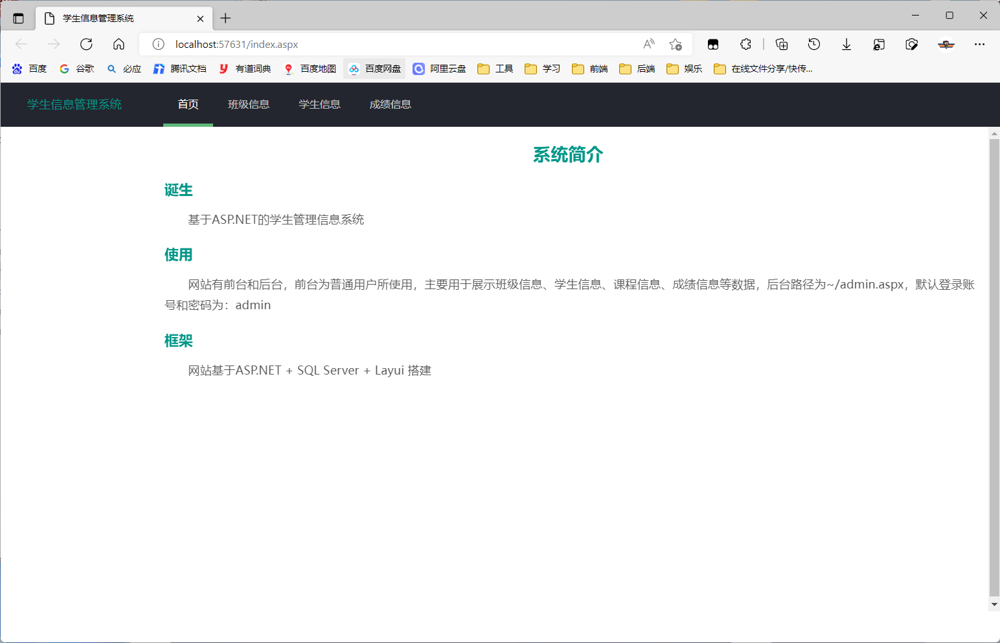

- 班级信息详情页

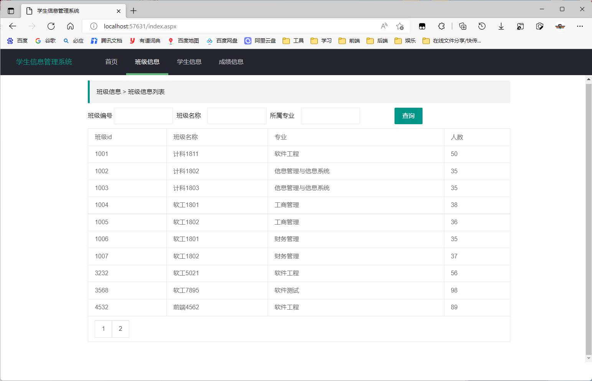

- 班级信息筛选（通过所属专业筛选）

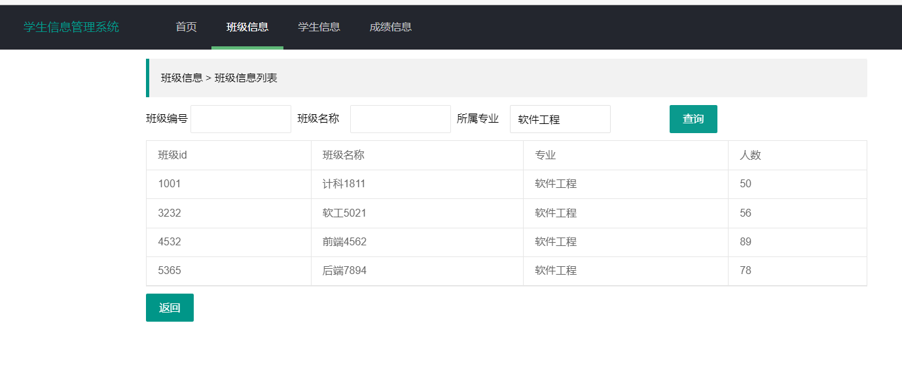

- 学生信息页面

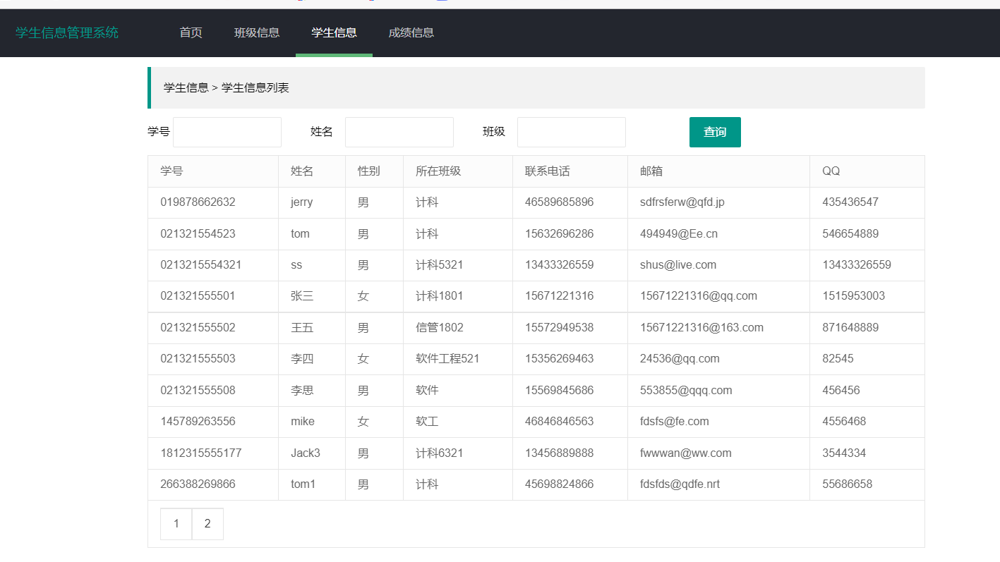

- 学生信息筛选（通过姓名筛选）

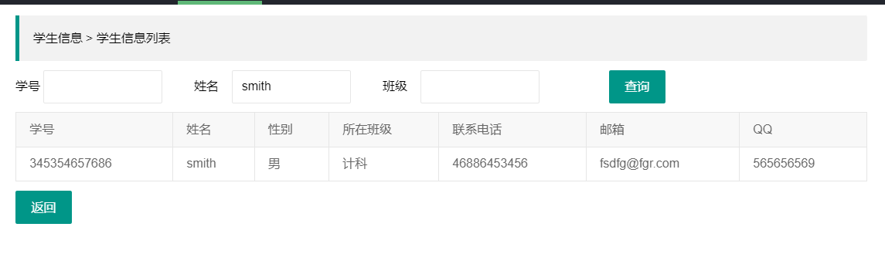

- 成绩信息页面

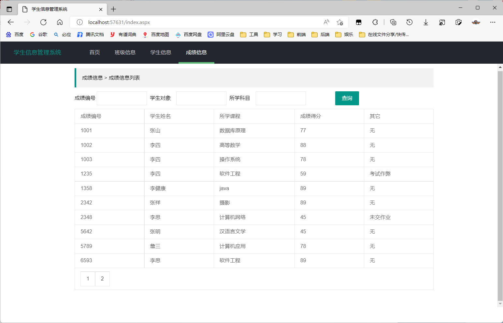

学生成绩信息筛选（通过所学科目筛选）

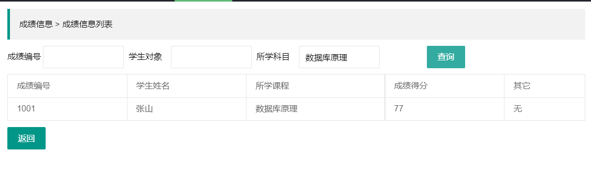

- 后台用户登录页面

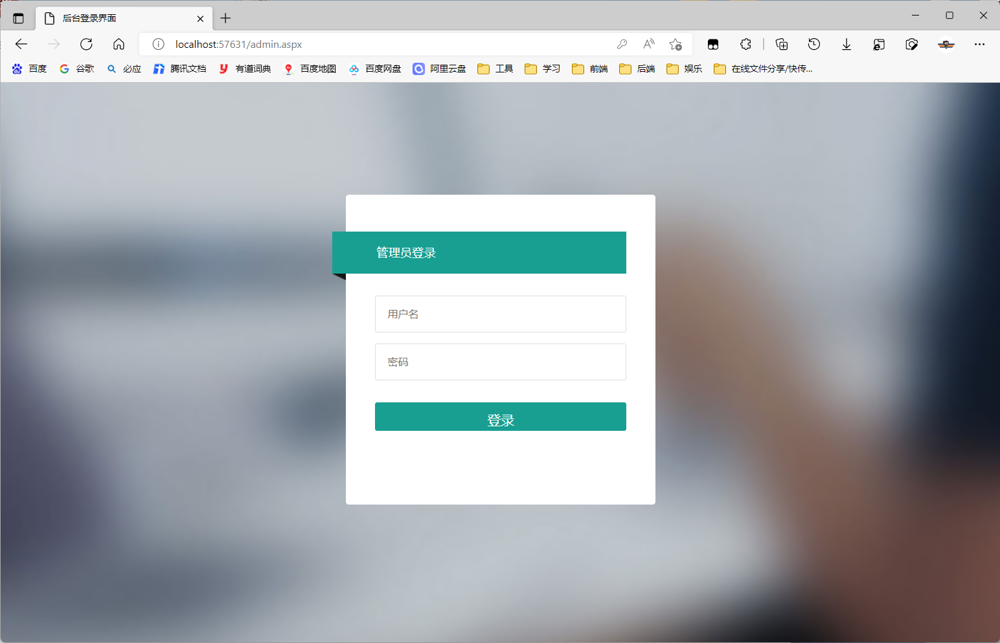

- 登录成功跳转到关于我界面

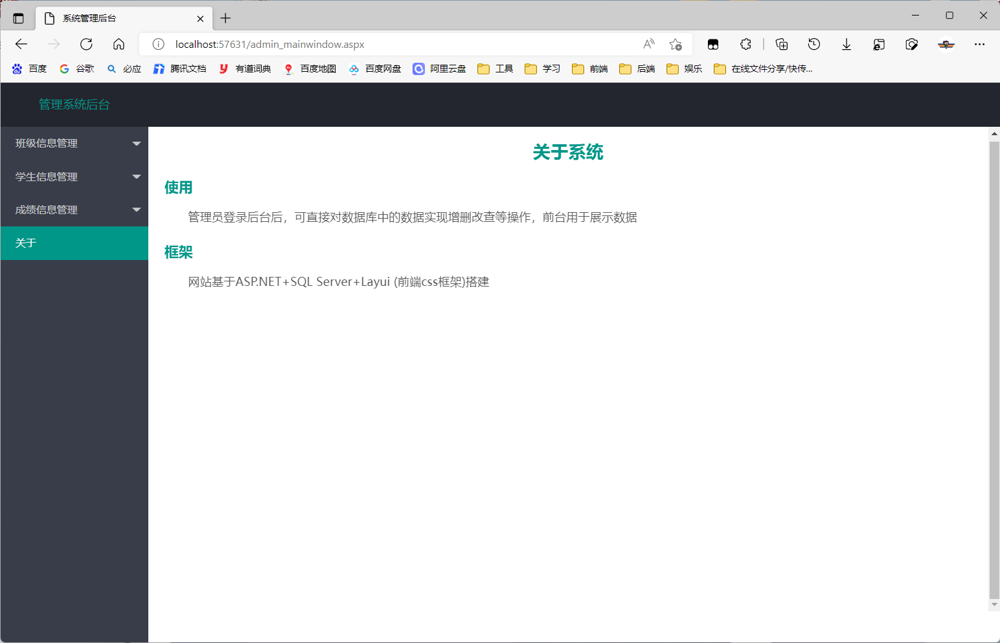

- 班级信息管理 ---> 添加班级信息

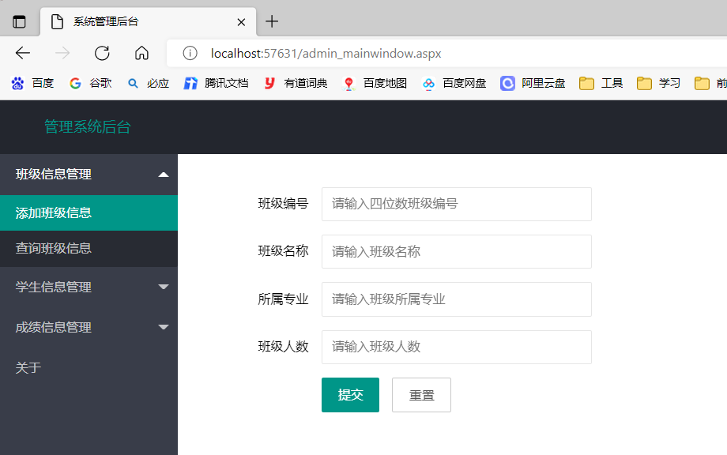

- 班级信息管理   ----> 查询所有班级信息，可以对班级进行修改和删除

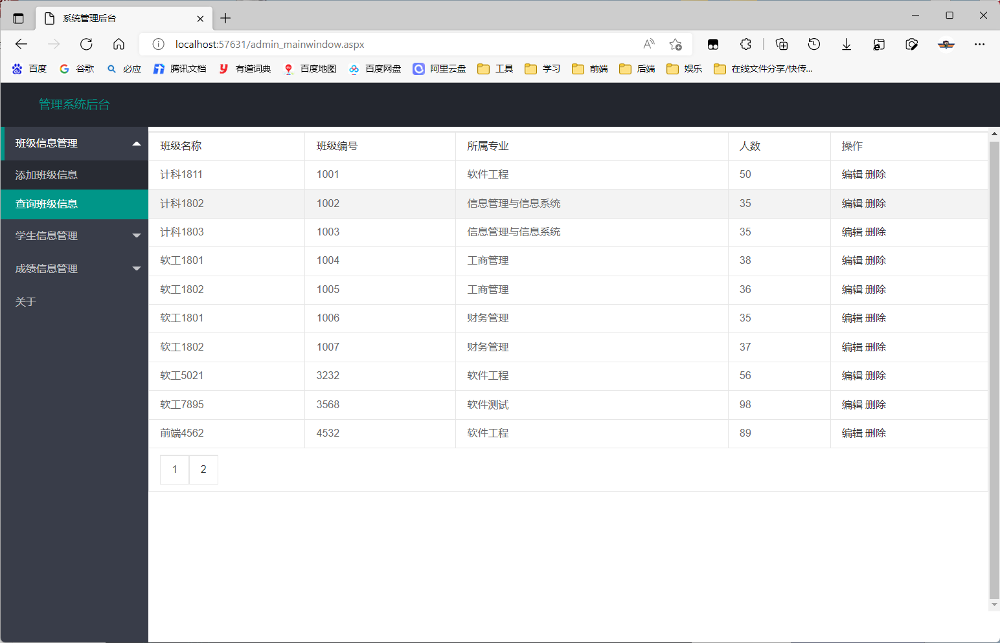

- 修改班级信息

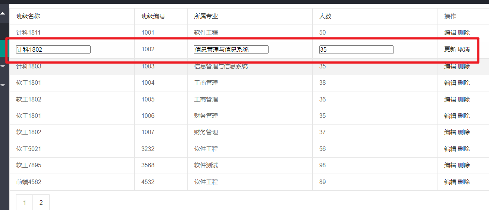

- 学生信息管理  ---->  添加学生信息

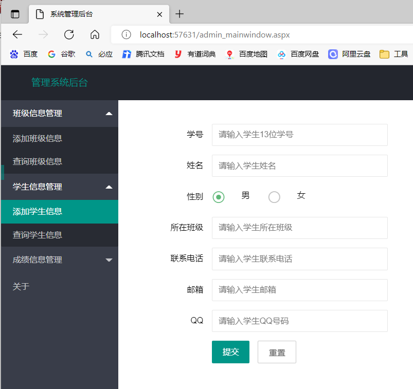

- 学生信息管理   ---> 查询学生信息

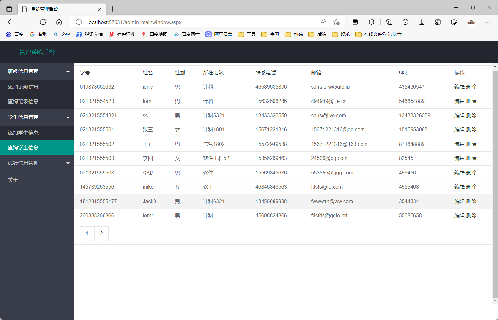

- 成绩信息管理   ---->  添加成绩信息

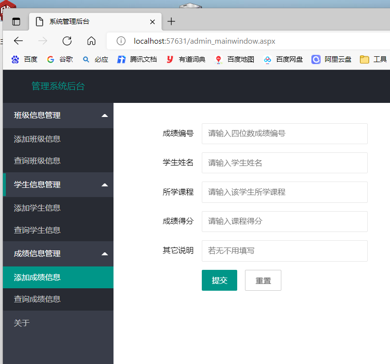

- 成绩信息管理  ---->  查询成绩信息

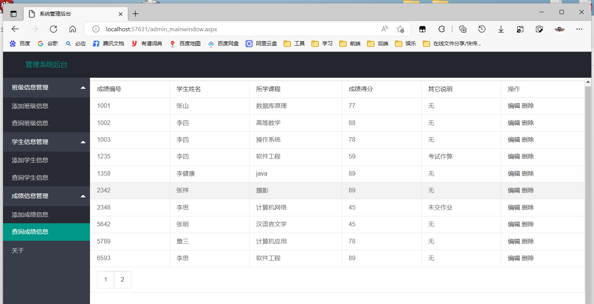

# 使用说明

- 将目录下的sql数据库文件在SqlServer中执行，运行程序即可
- 后台登录界面为 /admin.aspx ，默认账号：admin 密码：admin

# 数据库表设计

1. admin管理员表

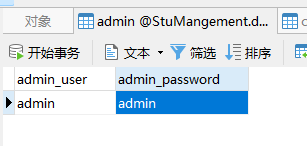

2. classinfo班级信息表	

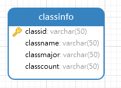

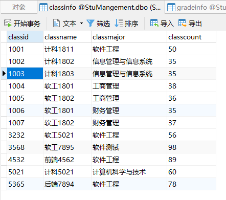

3. gradeinfo成绩表

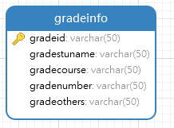

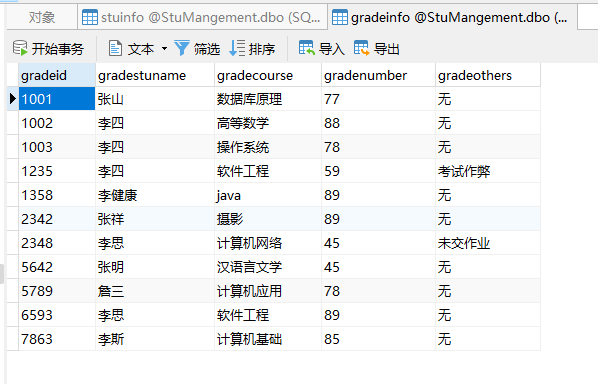

4.stuinfo学生表

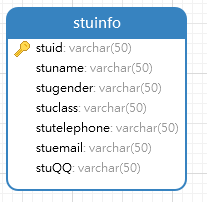

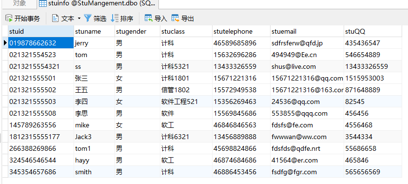